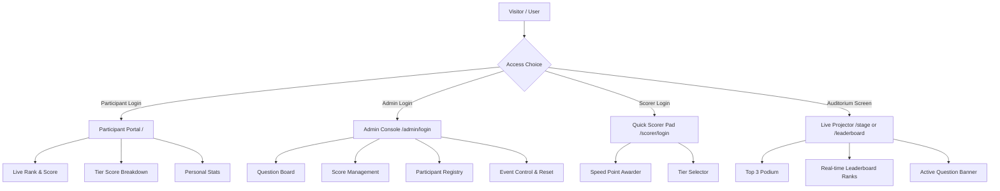

# ⚡ FunBuzz — Comprehensive System Documentation & Guide

**FunBuzz** is a real-time, interactive MERN-stack event platform engineered for college symposiums, hackathons, and quiz bonus-rounds / tie-breakers. It features live WebSocket-driven leaderboards, question board orchestration, multi-role access control, mobile-first participant dashboards, and a dedicated full-screen auditorium projector display.

---

## 📑 Table of Contents

1. [System Architecture](#-system-architecture)
2. [User Roles & Access Portals](#-user-roles--access-portals)
3. [Credentials & Seed Accounts](#-credentials--seed-accounts)
4. [Question Tiers & Scoring Logic](#-question-tiers--scoring-logic)
5. [Key Feature Breakdown](#-key-feature-breakdown)
   - [Admin Portal](#1-admin-portal)
   - [Scorer / Mark Provider Portal](#2-scorer--mark-provider-portal)
   - [Participant Portal](#3-participant-portal)
   - [Stage / Auditorium Projector](#4-stage--auditorium-projector-view)
6. [Real-time WebSocket Events](#-real-time-websocket-events)
7. [REST API Reference](#-rest-api-reference)
8. [Setup & Execution Commands](#-setup--execution-commands)
9. [Database & Persistence Modes](#-database--persistence-modes)

---

## 🏛️ System Architecture

```
                                  ┌────────────────────────┐
                                  │   Browser Clients      │
                                  └──────────┬─────────────┘
                                             │ HTTP / WebSocket (Port 5000)
                                             ▼
┌─────────────────────────────────────────────────────────────────────────────────┐
│                           FUNBUZZ SERVER (Node.js/Express)                      │
│                                                                                 │
│   ┌─────────────────────┐    ┌─────────────────────┐    ┌───────────────────┐   │
│   │ Express REST API    │    │ Socket.IO Hub       │    │ JWT Auth Guard    │   │
│   │ /api/auth           │    │ - score:updated     │    │ Roles: Admin,     │   │
│   │ /api/scores         │    │ - event:status      │    │ Scorer,           │   │
│   │ /api/questions      │    │ - question:status   │    │ Participant       │   │
│   │ /api/participants   │    │ - room channels     │    │                   │   │
│   └──────────┬──────────┘    └──────────┬──────────┘    └───────────────────┘   │
│              │                          │                                       │
│              └────────────┬─────────────┘                                       │
│                           ▼                                                     │
│                ┌───────────────────────┐                                        │
│                │   Mongoose Data Layer │                                        │
│                └──────────┬────────────┘                                        │
└───────────────────────────┼─────────────────────────────────────────────────────┘
                            ▼
     ┌──────────────────────────────────────────────┐
     │           MongoDB Storage                    │
     │   Local MongoDB / MongoMemoryServer (Auto)   │
     │   Collections: Users, Participants, Scores,   │
     │   Questions, Events, ScoreHistories          │
     └──────────────────────────────────────────────┘
```

### Technology Stack

| Layer | Component | Version / Tech | Role |
|---|---|---|---|
| **Frontend** | React + Vite | React 19, Vite 8 | Fast SPA rendering & modern hooks |
| **Styling** | Custom Responsive CSS | Dark theme, neon accents | Glassmorphism & high contrast UI |
| **Icons & Toasts** | Lucide React + React Hot Toast | Modern icon pack | Real-time notifications and feedback |
| **State & Sockets** | Socket.IO Client + React Context | v4.8 | Low-latency bi-directional sync |
| **Backend** | Node.js + Express | Express 4.21, ES/CommonJS | REST endpoints, middleware, socket server |
| **Database** | MongoDB + Mongoose | Mongoose 8.7 | Schemas, relations, competition ranking |
| **In-Memory Fallback** | `mongodb-memory-server` | v11.2 | Zero-config fallback when local DB is offline |

---

## 👥 User Roles & Access Portals

FunBuzz provides tailored interfaces for 4 distinct user groups:



---

## 🔑 Credentials & Seed Accounts

The platform comes pre-seeded with accounts ready for demonstration or immediate event use:

### 1. Administrators
| Role | Username | Password | URL | Permissions |
|---|---|---|---|---|
| **Primary Admin** | `admin` | `admin123` | `http://localhost:5173/admin/login` | Full system control |
| **Super Admin** | `superadmin` | `superadmin123` | `http://localhost:5173/admin/login` | Full system control |

### 2. Scorers / Evaluators (Mark Providers)
| Role | Username | Password | URL | Permissions |
|---|---|---|---|---|
| **Scorer 1** | `scorer` | `scorer123` | `http://localhost:5173/scorer/login` | Fast point entry |
| **Evaluator** | `evaluator` | `evaluator123` | `http://localhost:5173/scorer/login` | Fast point entry |

### 3. Pre-Seeded Participants
Participants log in at `http://localhost:5173/` using their **Roll Number** (and optional Name/Passcode):

| Roll Number | Participant Name | Passcode | Initial Score | Initial Rank |
|---|---|---|---|---|
| `26MCA101` | Arun Kumar | `pass101` | 50 pts | #1 |
| `26MCA102` | Rahul Sharma | `pass102` | 30 pts | #2 |
| `26MCA103` | Priya Nair | `pass103` | 20 pts | #3 |
| `26MCA104` | Karthik Menon | `pass104` | 0 pts | #4 |
| `26MCA105` | Sneha Reddy | `pass105` | 0 pts | #4 |
| `26MCA106` | Vishnu Dev | `pass106` | 0 pts | #4 |
| `26MCA107` | Anjali Pillai | `pass107` | 0 pts | #4 |
| `26MCA108` | Deepak Raj | `pass108` | 0 pts | #4 |
| `26MCA109` | Meera Suresh | `pass109` | 0 pts | #4 |
| `26MCA110` | Arjun Nambiar | `pass110` | 0 pts | #4 |

---

## 🎯 Question Tiers & Scoring Logic

Questions are categorized into 5 difficulty tiers, each carrying distinct point values and visual badges:

| Tier Symbol | Tier Name | Prefix | Point Value | Number of Questions | Color Theme |
|:---:|:---|:---:|:---:|:---:|:---:|
| 🌊 | **Chill** | `C` | **5 pts** | 10 (`C1` - `C10`) | Cyan / Sky Blue |
| 🔥 | **Blaze** | `B` | **10 pts** | 10 (`B1` - `B10`) | Amber / Orange |
| 💀 | **Savage** | `SV` | **15 pts** | 10 (`SV1` - `SV10`) | Purple / Violet |
| ☠️ | **Brutal** | `BR` | **20 pts** | 10 (`BR1` - `BR10`) | Rose / Red |
| 👑 | **Legendary** | `L` | **25 pts** | 10 (`L1` - `L10`) | Gold / Yellow |

### Standard Competition Ranking (1224)
Ties receive the same rank, and the next rank skips appropriately:
- If two players tie for Rank 1 with 50 points, both receive **Rank 1**.
- The subsequent participant with 30 points receives **Rank 3** (not Rank 2).

---

## 🚀 Key Feature Breakdown

### 1. Admin Portal (`/admin`)
- **Dashboard (`/admin/dashboard`)**:
  - Live event state monitor (Total participants, questions answered, total points awarded).
  - One-click event state toggles: **Start**, **Pause**, **End**, or **Reset**.
- **Question Board (`/admin/questions`)**:
  - Grid of all 50 questions filterable by tier.
  - Controls to mark a question as `Available`, `In-Progress`, or `Used`.
  - Feature to broadcast active questions directly to the Stage/Auditorium screen.
- **Participant Manager (`/admin/participants`)**:
  - Search, add new participants, edit details, or remove contestants.
- **Score Manager (`/admin/scores`)**:
  - Detailed point awarding interface with custom remarks.
  - Complete audit log (`ScoreHistory`) tracking who awarded what points, when, and for which tier.
- **Admin Leaderboard (`/admin/leaderboard`)**:
  - Real-time mirrored view of the rankings with tie-break indicators.

### 2. Scorer / Mark Provider Portal (`/scorer`)
- Designed specifically for judges or scoring volunteers.
- High-efficiency UI:
  1. Pick the participant.
  2. Select the tier or enter bonus points.
  3. Hit **Award Points**.
- Broadcasts changes across all connected devices within milliseconds.

### 3. Participant Portal (`/`)
- Mobile-first, responsive design tailored for smartphones.
- Shows:
  - Personal score and competition rank.
  - Breakdown across all 5 tiers (Chill, Blaze, Savage, Brutal, Legendary).
  - Live top-ranking participants and distance to the next rank.
  - Status banner alerting if the event is paused or active.

### 4. Stage / Auditorium Projector View (`/stage` or `/leaderboard`)
- Designed for large HDMI displays, TVs, and auditorium projectors.
- **Top 3 Podium**: Visual gold, silver, and bronze podium cards for 1st, 2nd, and 3rd place.
- **Active Question Ticker**: Shows the currently selected question live on screen.
- **Flashing Score Pulse**: Glows brightly whenever any participant scores points.
- **One-click Fullscreen Toggle**: Maximizes display without browser address bars or navigation headers.

---

## ⚡ Real-time WebSocket Events

The application uses Socket.IO on port 5000 to keep all screens in perfect sync without manual page reloads:

| Socket Event | Direction | Payload | Description |
|---|---|---|---|
| `join` | Client ➔ Server | `{ role, participantId? }` | Joins role-specific rooms (`admins`, `participants`, `participant:<id>`) |
| `score:updated` | Server ➔ Clients | `{ participantId, totalScore, scores, rank }` | Emitted when scores change; triggers instant UI update and pulse effect |
| `event:statusChanged`| Server ➔ Clients | `{ status: 'running'\|'paused'\|'ended' }` | Notifies all clients of event pause/resume/finish |
| `question:statusChanged`| Server ➔ Clients | `QuestionObject` | Updates question status on admin board & auditorium stage |
| `leaderboard:update`| Server ➔ Clients | `Array<LeaderboardEntry>` | Pushes updated standings after recalculation |

---

## 🔌 REST API Reference

### Authentication (`/api/auth`)
- `POST /api/auth/login` — Administrator & Scorer login (Returns JWT token).
- `POST /api/auth/scorer-login` — Dedicated Scorer login route.
- `POST /api/auth/participant-login` — Participant entry by Roll Number and optional passcode.
- `GET /api/auth/me` — Returns the authenticated profile from JWT token.

### Event Management (`/api/event`)
- `GET /api/event/status` — Returns current status (`running`, `paused`, `ended`).
- `PUT /api/event/status` — Updates event status (Admin only).
- `POST /api/event/reset` — Resets scores and questions to fresh initial state (Admin only).

### Scores & Leaderboard (`/api/scores` & `/api/leaderboard`)
- `GET /api/leaderboard` — Returns sorted leaderboard array with competition rankings.
- `POST /api/scores/award` — Awards points for a specific tier to a participant.
- `POST /api/scores/adjust` — Manual point adjustment with reason.
- `GET /api/scores/history` — Returns complete audit trail of point modifications.

### Questions & Participants (`/api/questions` & `/api/participants`)
- `GET /api/questions` — Lists all questions with status and point values.
- `PUT /api/questions/:id` — Update question text, points, or status.
- `GET /api/participants` — List all registered participants.
- `POST /api/participants` — Register a new participant.
- `DELETE /api/participants/:id` — Remove a participant.

---

## 💻 Setup & Execution Commands

### 1. Terminal 1: Backend Server
```powershell
cd server
npm install
npm run dev
```
*Port:* `http://localhost:5000`  
*Default Database:* Auto-starts `MongoMemoryServer` with pre-seeded questions and participants if local MongoDB service is inactive.

### 2. Terminal 2: Frontend Client
```powershell
cd client
npm install
npm run dev
```
*Port:* `http://localhost:5173`

### 3. Optional: Manual Database Re-seed
To restore all initial questions, test participants, and admin logins:
```powershell
cd server
npm run seed
```

---

## 💾 Database & Persistence Modes

1. **In-Memory Mode (Automatic Fallback)**:
   - When no local MongoDB daemon (`mongodb://localhost:27017`) is found, the server automatically starts an embedded in-memory MongoDB engine.
   - Ideal for demonstrations, development, and testing without setting up external database services.
2. **Persistent MongoDB (Production / Event Day)**:
   - To persist all scores across server restarts during the actual event, update `server/.env`:
   ```env
   MONGO_URI=mongodb://localhost:27017/funbuzz
   # Or MongoDB Atlas:
   # MONGO_URI=mongodb+srv://<user>:<password>@cluster.mongodb.net/funbuzz
   ```
